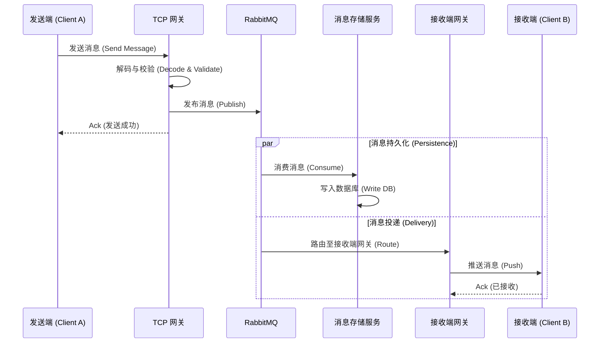

# 系统架构设计文档 (System Architecture)

## 1. 整体系统架构 (High-Level Architecture)
本图展示了系统的整体组件及其交互关系。

```mermaid
graph TD
    Client[客户端 App] -->|TCP/WebSocket| TCP_Gateway[TCP 网关 (Netty)]
    Client -->|HTTP| Service[业务服务 (Spring Boot)]
    
    subgraph "核心服务 (Core Services)"
        TCP_Gateway
        Service
        MsgStore[消息存储服务 (Message Store)]
    end
    
    subgraph "中间件 (Middleware)"
        ZK[Zookeeper (注册中心)]
        Redis[Redis (缓存)]
        RabbitMQ[RabbitMQ (消息队列)]
        MySQL[MySQL (数据库)]
    end
    
    TCP_Gateway -->|服务注册/发现| ZK
    Service -->|服务注册/发现| ZK
    
    TCP_Gateway -->|缓存会话信息| Redis
    Service -->|缓存用户信息| Redis
    
    TCP_Gateway -->|异步消息投递| RabbitMQ
    RabbitMQ -->|消费消息| MsgStore
    MsgStore -->|持久化存储| MySQL
    
    Service -->|数据读写 (CRUD)| MySQL
```

## 2. 消息发送流程 (Message Sending Flow)
展示消息从发送者流转到接收者的时序图。



## 3. 用户登录与会话管理 (User Login & Session Flow)
用户登录认证及长连接会话建立流程。

```mermaid
graph LR
    User[用户] -->|1. 登录请求| API[业务接口 (Service API)]
    API -->|2. 校验密码| DB[(MySQL)]
    API -->|3. 生成 Token| API
    API -->|4. 返回 Token| User
    
    User -->|5. 建立 TCP 连接| TCP[TCP 网关]
    TCP -->|6. 校验 Token| Redis[(Redis)]
    TCP -->|7. 注册 Session| ZK[Zookeeper]
    TCP -->|8. 同步离线消息| DB
```

## 4. 模块依赖关系 (Module Dependencies)
项目内部模块的依赖结构。

```mermaid
graph TD
    Root[im-server (父工程)]
    Root --> Common[common (公共模块)]
    Root --> Codec[codec (编解码)]
    Root --> TCP[tcp (长连接网关)]
    Root --> Service[service (业务逻辑)]
    Root --> Store[message-store (消息存储)]
    
    TCP --> Common
    TCP --> Codec
    Service --> Common
    Store --> Common
    Codec --> Common
```
